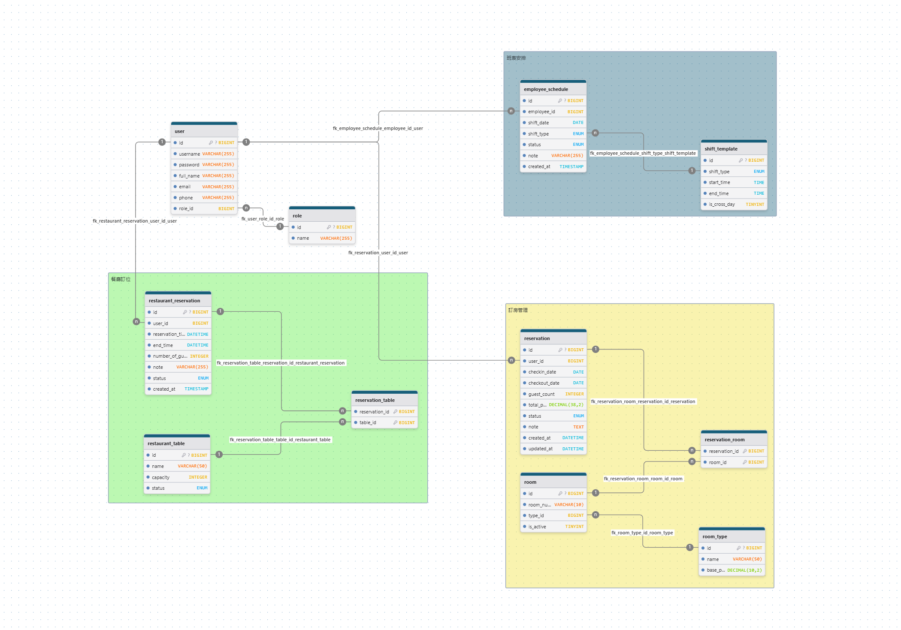
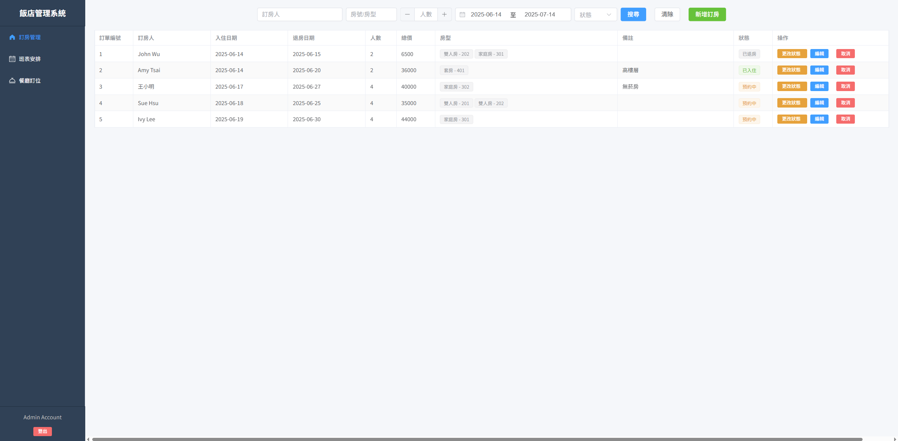
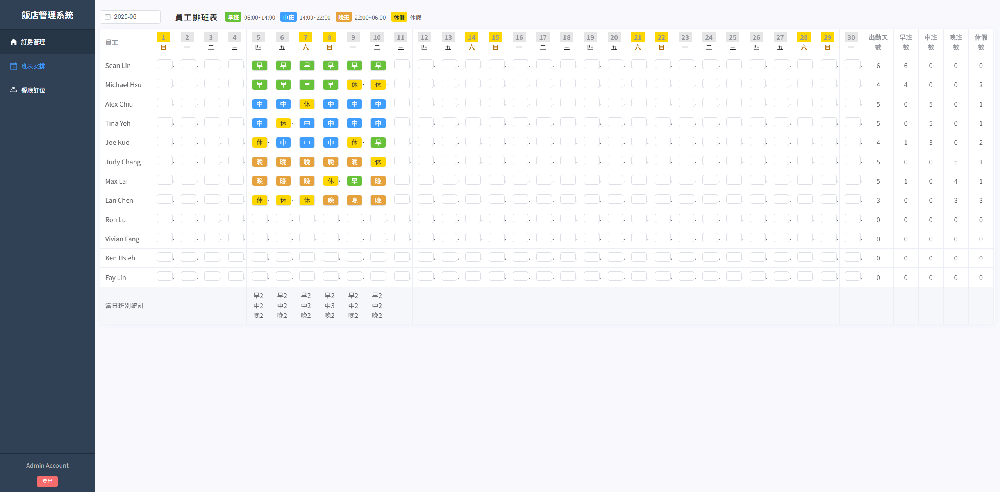
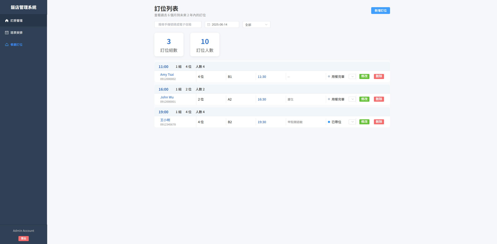

# Hotel Fubon 旅館管理系統

本專案為旅館管理系統示範，包含後端的 Spring Boot 專案與前端的 Vue 3 應用程式。專案提供 Docker 組態用於啟動 MySQL 資料庫，首次執行即會自動產生資料表與測試資料。

## 功能概要
- 使用者管理與權限角色
- 客房與房型管理
- 餐廳桌位與訂位管理
- 訂房及房間分配
- 員工排班與班表

## 環境需求
- **JDK 21** 以上
- **Node.js** (建議 18 版以上)
- **Docker** 與 **docker-compose**

## 資料庫設定
1. 進入 `db` 目錄並啟動容器：
   ```bash
   cd db
   docker-compose up -d
   ```
2. 啟動後資料庫連線資訊如下：
   - 主機：`localhost`
   - Port：`3307`（容器內部為 3306）
   - 使用者：`hotel_user`
   - 密碼：`hotelpass`
   - 資料庫：`hotel_db`

   `docker-compose.yml` 會掛載 `init.sql`，自動建立資料表並匯入測試資料。

   

## 執行步驟
1. **啟動 MySQL 容器**（如上所示）。
2. **啟動後端**：
   ```bash
   cd hotel-backend/hotel-system
   ./mvnw spring-boot:run
   ```
   伺服器預設埠號為 `8080`。
3. **啟動前端**：
   ```bash
   cd hotel-system-frontend/hotel-system-frontend
   npm install
   npm run dev
   ```
   Vite 會以預設的 `5173` 埠號啟動開發伺服器，並將 `/api` 的請求代理到後端。
4. 瀏覽器開啟 `http://localhost:5173` 即可進入前端介面。

## 測試方式

1. 可透過根目錄的Hotel-Fubon.postman_collection.json進行postman測試。


| 模組 | Method | Path                                              | 功能簡述                            |
| -- | ------ | ------------------------------------------------- | ------------------------------- |
| 訂房 | GET    | `/api/reservations`                               | 查詢所有訂房                          |
| 訂房 | GET    | `/api/reservations/{id}`                          | 透過 ID 查詢訂房                      |
| 訂房 | POST   | `/api/reservations`                               | 新增訂房（會員或非會員）                    |
| 訂房 | PATCH  | `/api/reservations/{id}`                          | 修改訂房（變更入住時間、房間、人數等）             |
| 訂房 | DELETE | `/api/reservations/{id}`                          | 刪除訂房                            |
| 訂房 | GET    | `/api/rooms/available?checkin={日期}&checkout={日期}` | 查詢空房清單（依時間區段）                   |
| 訂房 | GET    | `/api/reservations/with-rooms`                    | 查詢所有房型與所屬房間（for 下拉選單）           |
| 訂房 | PUT    | `/api/room-reservations/{id}/status?status={狀態}`  | 修改訂房狀態（如 CONFIRMED / CANCELLED） |
| 訂房 | DELETE | `/api/room-reservations/{id}`                     | 移除房間預約（舊 API，可忽略）               |


| 模組 | Method | Path                                                       | 功能簡述                |
| -- | ------ | ---------------------------------------------------------- | ------------------- |
| 餐廳 | GET    | `/api/restaurant/available-tables?start={開始時間}&end={結束時間}` | 查詢指定時間內的可用桌位        |
| 餐廳 | POST   | `/api/restaurant`                                          | 新增訂位（支援會員與非會員）      |
| 餐廳 | GET    | `/api/restaurant/{id}`                                     | 查詢特定訂位資料（by 訂位 ID）  |
| 餐廳 | GET    | `/api/restaurant/user/{userId}`                            | 查詢特定使用者的所有訂位紀錄      |
| 餐廳 | PUT    | `/api/restaurant/{id}`                                     | 修改訂位資訊（時間、桌號、人數）    |
| 餐廳 | PUT    | `/api/restaurant/{id}/status?status={狀態}`                  | 修改訂位狀態（如 CANCELLED） |
| 餐廳 | DELETE | `/api/restaurant/{id}`                                     | 取消餐廳訂位              |


| 模組 | Method | Path                           | 功能簡述              |
| -- | ------ | ------------------------------ | ----------------- |
| 排班 | POST   | `/api/schedules`               | 建立排班（需檢查是否違反排班規則） |
| 排班 | PUT    | `/api/schedules/{id}`          | 修改排班內容（班別、備註等）    |
| 排班 | GET    | `/api/schedules?month=2025-06` | 依月份查詢排班（參數格式推測）   |


2. 透過前端測試
   
   # 飯店管理系統 - 測試說明文件 (Test Plan)

**專案名稱**: 飯店管理系統  
**測試日期**: 2025-06-14  
**測試人員**: 開發者/測試者  
**測試方式**: Postman / Web UI 模擬操作 / API 測試

---

## 一、登入功能測試

## 預設帳號（init.sql 已含）
| 帳號 | 密碼 | 角色 |
|------|------|------|
| admin01 | 123456 | ADMIN |
| staff01 | staffpass | STAFF |


| 測試項目 | 測試步驟 | 預期結果 |
|----------|-----------|----------|
| 僅限 admin / staff 登入 | 嘗試使用 role = customer 的帳號登入將禁止登入 |
| 正常登入流程 | 使用 admin 或 staff 登入系統 | 成功進入後台管理介面 |

---

## 二、訂房管理系統測試


 

### 1. 訂房清單顯示

| 測試項目 | 測試步驟 | 預期結果 |
|----------|-----------|----------|
| 顯示近 30 天訂房 | 進入訂房頁面 | 自動載入今日起 30 天內的訂房，依照入住日期排序 |

### 2. 新增訂房（會員與非會員）

| 測試項目 | 測試步驟 | 預期結果 |
|----------|-----------|----------|
| 會員訂房流程 | 選擇會員（從 role = customer 的 user 下拉選取）並選擇日期及人數，API會自動抓取該時段的空房 | 成功顯示可用房型並完成訂房 |
| 非會員訂房 | 手動輸入姓名與電話，選擇日期及人數，自動抓取該時段的空房 | 成功顯示空房選單並完成訂房 |

### 3. 訂房狀態操作

| 測試項目 | 測試步驟 | 預期結果 |
|----------|-----------|----------|
| 更改狀態 | 點擊狀態變更按鈕並選擇「已入住」 | 訂單狀態成功更新 |
| 取消訂房 | 點擊取消按鈕 | 狀態變為「取消」，並釋出房間 |

### 4. 編輯訂單

| 測試項目 | 測試步驟 | 預期結果 |
|----------|-----------|----------|
| 修改入住日期與房型 | 點擊編輯，修改日期與房型 | 即時抓取空房，若有空房則成功儲存 |

### 5. 搜尋功能

| 測試項目 | 測試步驟 | 預期結果 |
|----------|-----------|----------|
| 搜尋訂房人、房號、人數、日期、狀態等條件 | 使用多條件搜尋 | 正確篩選出符合條件的訂單 |

---

## 三、班表安排測試

 

### 1. 權限控制

| 測試項目 | 測試步驟 | 預期結果 |
|----------|-----------|----------|
| admin 可編輯班表 | admin 登入後開啟班表頁面 | 可安排排班、點選儲存 |
| staff 權限檢查 | staff 登入後開啟班表頁面 | 僅能瀏覽，無法編輯 |

### 2. 排班功能

| 測試項目 | 測試步驟 | 預期結果 |
|----------|-----------|----------|
| 自動顯示月份 | 開啟班表頁面 | 自動顯示當月班表，假日高亮 |
| 自動抓取 staff 清單 | 開啟班表頁面 | 顯示所有 role = staff 的員工 |
| 點選員工安排班別 | 點選格子 → 選擇班別 | 成功儲存排班資料 |
| 超過連上 6 天 | 排連續 7 天班 | 顯示錯誤提示並阻擋儲存 |
| 銜接規則驗證 | 依規則安排不合邏輯班別（如晚班後排早班） | 顯示錯誤提示並阻止 |

### 3. 排班統計

| 測試項目 | 測試步驟 | 預期結果 |
|----------|-----------|----------|
| 員工統計區塊 | 完成部分排班 | 自動統計出勤、各班別天數、休假數 |
| 每日人力統計 | 填滿一週班表 | 顯示每日早中晚班人數 |

---

## 四、餐廳訂位測試

 

### 1. 預設顯示與統計資訊

| 測試項目 | 測試步驟 | 預期結果 |
|----------|-----------|----------|
| 預設顯示當天訂位 | 進入訂位頁面 | 自動顯示今日所有訂位資料 |
| 訂位統計 | 有數筆訂位資料 | 顯示預定組數、總人數統計 |

### 2. 新增訂位（會員與非會員）

| 測試項目 | 測試步驟 | 預期結果 |
|----------|-----------|----------|
| 選擇時間 | 選擇 10:00 ~ 22:00 的任一時段（每 30 分鐘） | 成功載入可訂位的時間段，並即時抓取該時段空桌 |
| 會員訂位 | 從 role = customer 選擇會員 | 自動顯示會員資料並完成訂位 |
| 非會員訂位 | 手動輸入姓名與電話 | 成功完成訂位 |

### 3. 修改與取消訂位

| 測試項目 | 測試步驟 | 預期結果 |
|----------|-----------|----------|
| 更改狀態 | 點選「狀態」並選擇「已帶位」或「用餐完畢」 | 訂單狀態變更成功 |
| 修改時間與桌號 | 點擊修改按鈕 → 更改時間 | 成功重新查詢可用桌號並儲存 |
| 取消訂位 | 點擊取消按鈕 | 訂位狀態設為取消 |

---
